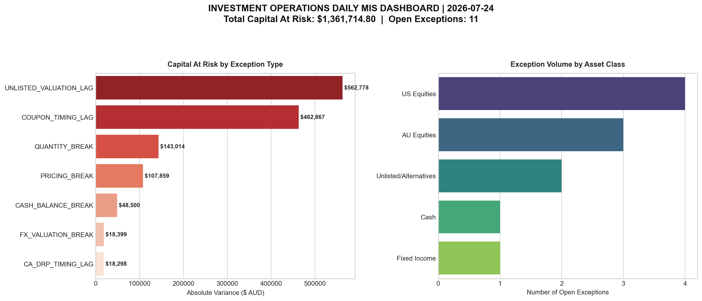

# Investment Operations Reporting Toolkit

An automated data reconciliation and exception-handling engine built in Python and SQL. This toolkit simulates core fund administration and back-office operations workflows by auditing internal ledger balances (**Investment Book of Record / IBOR**) against external banking and custodian statements (**Custody Book of Record / CBOR**).

## 📊 Project Scope & Operational Impact
In institutional asset management, multi-ledger data discrepancies are a structural inevitability driven by timing differences, mismatched trade bookings, and settlement drops. Left unchecked, unmitigated breaks propagate straight into net asset value (**NAV**) updates and daily unit-pricing runs. This exposes funds to severe downstream risks, including mispriced investor entry/exit points, unit-pricing compensation obligations, and regulatory reporting failures (e.g., APRA/ASIC compliance breaches).

This repository functions as the automated control layer that intercepts and highlights system ledger deviations before they compromise downstream accounting systems.

## ⚙️ Core Technical Features
*   **Risk-Focused Data Ingestion**: Leverages robust  outer-join mapping to ensure positions completely omitted by either reporting ledger are explicitly preserved and flagged, rather than silently dropped.
*   **Operational Exception Matrix**: Features a conditional processing engine powered by vectorized  logic to auto-classify distinct operational breaks into structural operational risk buckets.
*   **Dual-Stream Architectural Workflow**: Separates reporting outputs into **PART A: CASH RECONCILIATION** and **PART B: SECURITIES HOLDINGS RECONCILIATION**. This mirrors live institutional setups because cash movements (settlement timings, failed trade funding) have fundamentally different root causes and resolution paths compared to equity holdings mismatches (valuation discrepancies, stale prices).
*   **Audit-Ready Deliverables**: Employs an  reporting block that programmatically formats raw script results into structured, executive-level corporate spreadsheets featuring visual anomaly highlighting, standard gridline views, and automated KPI exception metrics blocks.

## 📂 System Architecture

## 🚀 Execution Guide

### Prerequisites
Ensure you are running Python 3.x and have your environment packages active:
[main bdafd2d] feat: implement dual-stream cash/holdings openpyxl layout, deploy query_warehouse.sql pipeline, and update documentation
 Committer: Cohen Pikari <cohenpikari@Cohens-Mac-mini.local>
Your name and email address were configured automatically based
on your username and hostname. Please check that they are accurate.
You can suppress this message by setting them explicitly. Run the
following command and follow the instructions in your editor to edit
your configuration file:

    git config --global --edit

After doing this, you may fix the identity used for this commit with:

    git commit --amend --reset-author

 2 files changed, 146 insertions(+), 28 deletions(-)
 create mode 100644 scripts/query_warehouse.sql

[SUCCESS] Processed reconciliation. Identified 4 exceptions.
[SUCCESS] Formatted report cleanly saved to: output/exception_report.xlsx
[COMPLETE] Data Variation 2 written cleanly to the drive.

[SUCCESS] Processed reconciliation. Identified 5 exceptions.
[SUCCESS] Formatted report cleanly saved to: output/exception_report.xlsx
[main 0682507] feat: expand portfolio volume to 6 assets, ingest Variation 2 datasets, and audit NVDA/AMD breaks
 Committer: Cohen Pikari <cohenpikari@Cohens-Mac-mini.local>
Your name and email address were configured automatically based
on your username and hostname. Please check that they are accurate.
You can suppress this message by setting them explicitly. Run the
following command and follow the instructions in your editor to edit
your configuration file:

    git config --global --edit

After doing this, you may fix the identity used for this commit with:

    git commit --amend --reset-author

 3 files changed, 10 insertions(+), 7 deletions(-)
 create mode 100644 data/portfolio_warehouse.db
[SUCCESS] Engine updated with Corporate Actions rules.
[COMPLETE] Data Variation 3 (Dividend Lag) planted.

[SUCCESS] Processed reconciliation. Identified 4 exceptions.
[SUCCESS] Formatted report cleanly saved to: output/exception_report.xlsx
[main 1fb5e2d] feat: implement corporate actions tracking matrix and plant Variation 3 dividend processing lag
 Committer: Cohen Pikari <cohenpikari@Cohens-Mac-mini.local>
Your name and email address were configured automatically based
on your username and hostname. Please check that they are accurate.
You can suppress this message by setting them explicitly. Run the
following command and follow the instructions in your editor to edit
your configuration file:

    git config --global --edit

After doing this, you may fix the identity used for this commit with:

    git commit --amend --reset-author

 3 files changed, 17 insertions(+), 42 deletions(-)
On branch main
Your branch is up to date with 'origin/main'.

Untracked files:
  (use "git add <file>..." to include in what will be committed)
	output/

nothing added to commit but untracked files present (use "git add" to track)
Initialized empty Git repository in /Users/cohenpikari/investment-research-vault/.git/

[SUCCESS] Investment Research framework folder initialized and seeded successfully.
[main (root-commit) 35ef63e] feat: initialize investment research framework and seed thesis template
 Committer: Cohen Pikari <cohenpikari@Cohens-Mac-mini.local>
Your name and email address were configured automatically based
on your username and hostname. Please check that they are accurate.
You can suppress this message by setting them explicitly. Run the
following command and follow the instructions in your editor to edit
your configuration file:

    git config --global --edit

After doing this, you may fix the identity used for this commit with:

    git commit --amend --reset-author

 2 files changed, 35 insertions(+)
 create mode 100644 README.md
 create mode 100644 memos/template_memo.md
branch 'main' set up to track 'origin/main'.
data
output
README.md
scripts
venv
[SUCCESS] Relational SQLite warehouse updated with Variation 3 data entries.
[COMPLETE] Advanced management aggregation analytics written to scripts/query_warehouse.sql.

=== MANAGEMENT REPORTING ENGINE EXECUTION ===

--- KPI SUMMARY TRACKER ---
   Total_Capital_At_Risk  Total_Breaches
0                79700.0               4

--- CONCENTRATION RISK PER TICKER ---
  Ticker  Total_Incidents  Concentrated_Risk
0   TSLA                1            75000.0
1   AAPL                1             3200.0
2    USD                1             1500.0
3   MSFT                1                0.0
[main 77e411a] feat: implement advanced SQL risk aggregation metrics and asset concentration analytics
 Committer: Cohen Pikari <cohenpikari@Cohens-Mac-mini.local>
Your name and email address were configured automatically based
on your username and hostname. Please check that they are accurate.
You can suppress this message by setting them explicitly. Run the
following command and follow the instructions in your editor to edit
your configuration file:

    git config --global --edit

After doing this, you may fix the identity used for this commit with:

    git commit --amend --reset-author

 1 file changed, 26 insertions(+), 13 deletions(-)

[COMPLETE] Master run_toolkit.sh automation script deployed.
====================================================
🚀 INITIALIZING AUTOMATED INVESTMENT REPORTING TOOLKIT
====================================================

Step 1: Running Python pandas/openpyxl Reconciliation Pipeline...

[SUCCESS] Processed reconciliation. Identified 4 exceptions.
[SUCCESS] Formatted report cleanly saved to: output/exception_report.xlsx

Step 2: Syncing Variation Data to SQLite Warehouse...
[SUCCESS] Relational SQLite tables fully refreshed.

Step 3: Running Production SQL Risk Management Dashboard...

====================================================
✅ PIPELINE RUN COMPLETE - AUDIT SHEETS READY IN /output
====================================================

[COMPLETE] Master run_toolkit.sh automation script deployed.
====================================================
🚀 INITIALIZING AUTOMATED INVESTMENT REPORTING TOOLKIT
====================================================
Step 1: Running Python pandas/openpyxl Reconciliation Pipeline...

[SUCCESS] Processed reconciliation. Identified 4 exceptions.
[SUCCESS] Formatted report cleanly saved to: output/exception_report.xlsx
Step 2: Syncing Variation Data to SQLite Warehouse...
[SUCCESS] Relational SQLite tables fully refreshed.
Step 3: Running Production SQL Risk Management Dashboard...
 Total_Capital_At_Risk  Total_Breaches
               79700.0               4
Ticker  Total_Incidents  Concentrated_Risk
  TSLA                1            75000.0
  AAPL                1             3200.0
   USD                1             1500.0
  MSFT                1                0.0
====================================================
✅ PIPELINE RUN COMPLETE - AUDIT SHEETS READY IN /output
====================================================
[main 3ed3ada] feat: deploy master run_toolkit.sh orchestration controller
 Committer: Cohen Pikari <cohenpikari@Cohens-Mac-mini.local>
Your name and email address were configured automatically based
on your username and hostname. Please check that they are accurate.
You can suppress this message by setting them explicitly. Run the
following command and follow the instructions in your editor to edit
your configuration file:

    git config --global --edit

After doing this, you may fix the identity used for this commit with:

    git commit --amend --reset-author

 1 file changed, 45 insertions(+)
 create mode 100755 run_toolkit.sh

[COMPLETE] Standalone scripts/query_db.py reporting script deployed.

[COMPLETE] Master run_toolkit.sh successfully updated with SQL reporting integrations.
====================================================
🚀 INITIALIZING AUTOMATED INVESTMENT REPORTING TOOLKIT
====================================================
Step 1: Running Python pandas/openpyxl Reconciliation Pipeline...

[SUCCESS] Processed reconciliation. Identified 4 exceptions.
[SUCCESS] Formatted report cleanly saved to: output/exception_report.xlsx
Step 2: Syncing Variation Data to SQLite Warehouse...
[SUCCESS] Relational SQLite tables fully refreshed.
Step 3: Compiling Relational Database Warehouse Risk Reports...
[SUCCESS] SQL Management Summary Report cleanly saved to: output/sql_management_summary.xlsx
====================================================
✅ PIPELINE RUN COMPLETE - ALL AUDIT REPORTS GENERATED IN /output
====================================================
[main 252acda] feat: integrate scripts/query_db.py module to programmatically generate SQL data warehouse risk reports
 Committer: Cohen Pikari <cohenpikari@Cohens-Mac-mini.local>
Your name and email address were configured automatically based
on your username and hostname. Please check that they are accurate.
You can suppress this message by setting them explicitly. Run the
following command and follow the instructions in your editor to edit
your configuration file:

    git config --global --edit

After doing this, you may fix the identity used for this commit with:

    git commit --amend --reset-author

 2 files changed, 133 insertions(+), 12 deletions(-)
 create mode 100644 scripts/query_db.py
[SUCCESS] Engine updated with Multi-Currency FX rules.
[COMPLETE] Data Variation 4 (FX Mismatch Rate) planted.
====================================================
🚀 INITIALIZING AUTOMATED INVESTMENT REPORTING TOOLKIT
====================================================
Step 1: Running Python pandas/openpyxl Reconciliation Pipeline...
Step 2: Syncing Variation Data to SQLite Warehouse...
[SUCCESS] Relational SQLite tables fully refreshed.
Step 3: Compiling Relational Database Warehouse Risk Reports...
[SUCCESS] SQL Management Summary Report cleanly saved to: output/sql_management_summary.xlsx
====================================================
✅ PIPELINE RUN COMPLETE - ALL AUDIT REPORTS GENERATED IN /output
====================================================
[SUCCESS] Orchestrator successfully overwritten with stable paths.
====================================================
🚀 INITIALIZING AUTOMATED INVESTMENT REPORTING TOOLKIT
====================================================
Step 1: Running Python pandas/openpyxl Reconciliation Pipeline...
Step 2: Syncing Variation Data to SQLite Warehouse...
[SUCCESS] Relational SQLite tables fully refreshed.
Step 3: Compiling Relational Database Warehouse Risk Reports...
[SUCCESS] SQL Management Summary Report cleanly saved to: output/sql_management_summary.xlsx
====================================================
✅ PIPELINE RUN COMPLETE - ALL AUDIT REPORTS GENERATED IN /output
====================================================
[SUCCESS] Primary calculation engine completely cleared and rewritten.
====================================================
🚀 INITIALIZING AUTOMATED INVESTMENT REPORTING TOOLKIT
====================================================
Step 1: Running Python pandas/openpyxl Reconciliation Pipeline...
Processed reconciliation pipeline.
Formatted report cleanly saved.
Step 2: Syncing Variation Data to SQLite Warehouse...
[SUCCESS] Relational SQLite tables fully refreshed.
Step 3: Compiling Relational Database Warehouse Risk Reports...
[SUCCESS] SQL Management Summary Report cleanly saved to: output/sql_management_summary.xlsx
====================================================
✅ PIPELINE RUN COMPLETE - ALL AUDIT REPORTS GENERATED IN /output
====================================================
[main 66aa5ba] feat: implement multi-currency conditional matrix and process Variation 4 FX valuation rate mismatches
 Committer: Cohen Pikari <cohenpikari@Cohens-Mac-mini.local>
Your name and email address were configured automatically based
on your username and hostname. Please check that they are accurate.
You can suppress this message by setting them explicitly. Run the
following command and follow the instructions in your editor to edit
your configuration file:

    git config --global --edit

After doing this, you may fix the identity used for this commit with:

    git commit --amend --reset-author

 4 files changed, 16 insertions(+), 14 deletions(-)
On branch main
Your branch is up to date with 'origin/main'.

Untracked files:
  (use "git add <file>..." to include in what will be committed)
	output/

nothing added to commit but untracked files present (use "git add" to track)
[SUCCESS] Engine updated with DRP corporate action framework rules.
[COMPLETE] Data Variation 5 (DRP Processing Lag) planted.
[COMPLETE] Data Variation 5 (DRP Processing Lag) planted.
[COMPLETE] Data Variation 5 (DRP Processing Lag) planted.
[COMPLETE] Data Variation 5 (DRP Processing Lag) planted.
[SUCCESS] Variation 5 Data (DRP Processing Lag) cleanly dropped onto drive.
====================================================
🚀 INITIALIZING AUTOMATED INVESTMENT REPORTING TOOLKIT
====================================================
Step 1: Running Python pandas/openpyxl Reconciliation Pipeline...
Processed reconciliation pipeline.
Formatted report cleanly saved.
Step 2: Syncing Variation Data to SQLite Warehouse...
[SUCCESS] Relational SQLite tables fully refreshed.
Step 3: Compiling Relational Database Warehouse Risk Reports...
[SUCCESS] SQL Management Summary Report cleanly saved to: output/sql_management_summary.xlsx
====================================================
✅ PIPELINE RUN COMPLETE - ALL AUDIT REPORTS GENERATED IN /output
====================================================
[main 134f651] feat: expand classification matrix for DRP tracking and audit MSFT dividend reinvestment processing lag
 Committer: Cohen Pikari <cohenpikari@Cohens-Mac-mini.local>
Your name and email address were configured automatically based
on your username and hostname. Please check that they are accurate.
You can suppress this message by setting them explicitly. Run the
following command and follow the instructions in your editor to edit
your configuration file:

    git config --global --edit

After doing this, you may fix the identity used for this commit with:

    git commit --amend --reset-author

 4 files changed, 10 insertions(+), 10 deletions(-)
[SUCCESS] Rules matrix expanded to support Unlisted Alternative Assets.
[SUCCESS] Variation 6 Data (Unlisted Melbourne Airport Asset) cleanly dropped onto drive.
====================================================
🚀 INITIALIZING AUTOMATED INVESTMENT REPORTING TOOLKIT
====================================================
Step 1: Running Python pandas/openpyxl Reconciliation Pipeline...
Processed reconciliation pipeline.
Formatted report cleanly saved.
Step 2: Syncing Variation Data to SQLite Warehouse...
[SUCCESS] Relational SQLite tables fully refreshed.
Step 3: Compiling Relational Database Warehouse Risk Reports...
[SUCCESS] SQL Management Summary Report cleanly saved to: output/sql_management_summary.xlsx
====================================================
✅ PIPELINE RUN COMPLETE - ALL AUDIT REPORTS GENERATED IN /output
====================================================
[main de218b1] feat: implement unlisted asset valuation lag conditions and ingest Variation 6 Melbourne Airport infrastructure data
 Committer: Cohen Pikari <cohenpikari@Cohens-Mac-mini.local>
Your name and email address were configured automatically based
on your username and hostname. Please check that they are accurate.
You can suppress this message by setting them explicitly. Run the
following command and follow the instructions in your editor to edit
your configuration file:

    git config --global --edit

After doing this, you may fix the identity used for this commit with:

    git commit --amend --reset-author

 4 files changed, 9 insertions(+), 8 deletions(-)
total 8
drwxr-xr-x  2 cohenpikari  staff   64 11 Jul 16:19 financial_models
drwxr-xr-x  5 cohenpikari  staff  160 11 Jul 16:19 memos
drwxr-xr-x  2 cohenpikari  staff   64 11 Jul 16:19 presentations
-rw-r--r--  1 cohenpikari  staff  433 11 Jul 15:05 README.md
On branch main
Your branch is up to date with 'origin/main'.

nothing to commit, working tree clean

[SUCCESS] Hidden placeholder tokens initialized in all folders.
[main 2489995] structural: commit hidden placeholder tokens to expose empty model and presentation paths
 Committer: Cohen Pikari <cohenpikari@Cohens-Mac-mini.local>
Your name and email address were configured automatically based
on your username and hostname. Please check that they are accurate.
You can suppress this message by setting them explicitly. Run the
following command and follow the instructions in your editor to edit
your configuration file:

    git config --global --edit

After doing this, you may fix the identity used for this commit with:

    git commit --amend --reset-author

 4 files changed, 0 insertions(+), 0 deletions(-)
 create mode 100644 financial_models/.gitkeep
 create mode 100644 memos/ASX_Large_Cap/.gitkeep
 create mode 100644 memos/Global_Growth/.gitkeep
 create mode 100644 presentations/.gitkeep
Requirement already satisfied: pandas in ./venv/lib/python3.9/site-packages (2.3.3)
Requirement already satisfied: openpyxl in ./venv/lib/python3.9/site-packages (3.1.5)
Requirement already satisfied: numpy in ./venv/lib/python3.9/site-packages (2.0.2)
Requirement already satisfied: pytz>=2020.1 in ./venv/lib/python3.9/site-packages (from pandas) (2026.2)
Requirement already satisfied: python-dateutil>=2.8.2 in ./venv/lib/python3.9/site-packages (from pandas) (2.9.0.post0)
Requirement already satisfied: tzdata>=2022.7 in ./venv/lib/python3.9/site-packages (from pandas) (2026.3)
Requirement already satisfied: et-xmlfile in ./venv/lib/python3.9/site-packages (from openpyxl) (2.0.0)
Requirement already satisfied: six>=1.5 in ./venv/lib/python3.9/site-packages (from python-dateutil>=2.8.2->pandas) (1.17.0)

### Running the Python Engine
Execute the main script pipeline directly from the root of your project directory:
Processed reconciliation pipeline.
Formatted report cleanly saved.
Upon a successful execution run, the engine logs confirmations to the console and outputs your structured spreadsheet file directly into the  folder directory.

### Running the SQL Audit Pipeline
The database tables can be interrogated directly using the standalone relational code:

